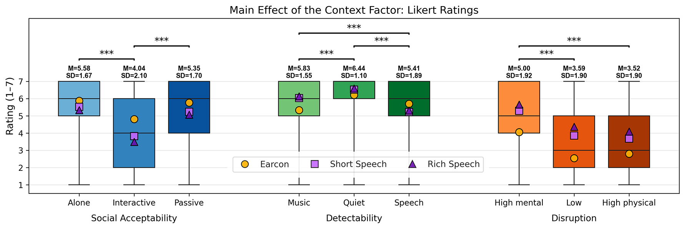
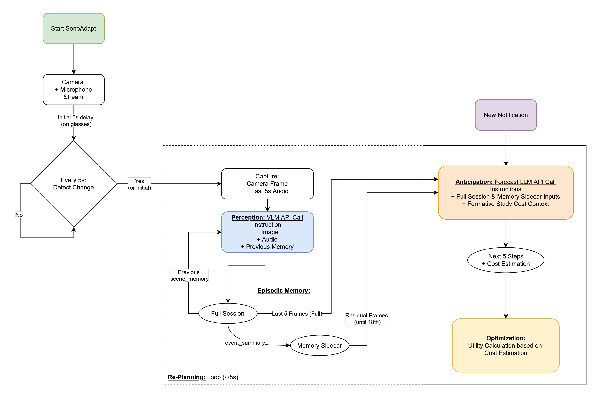
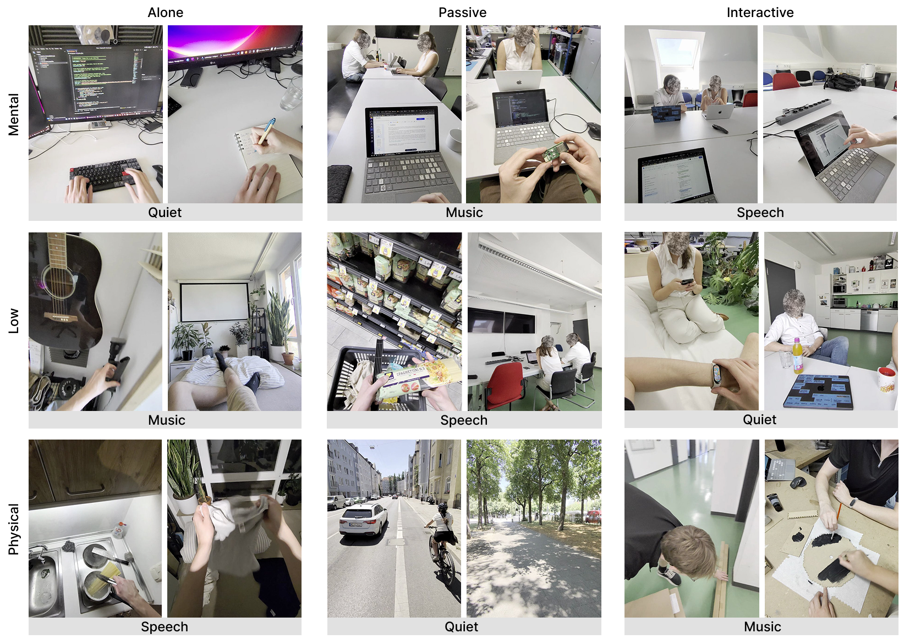
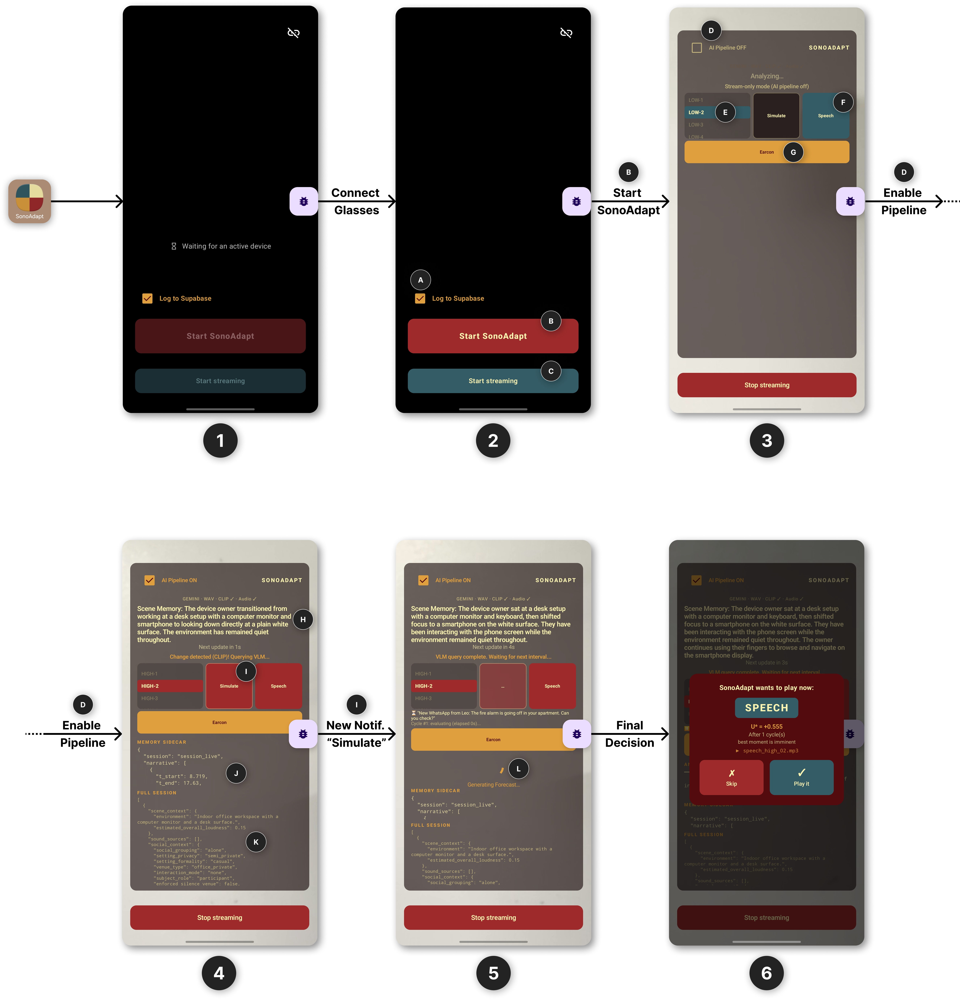
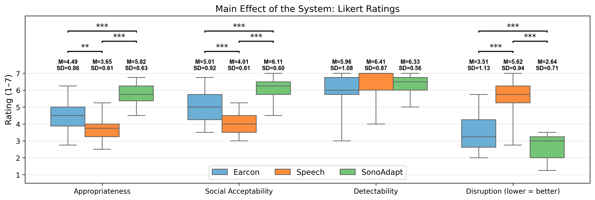

# SonoAdapt

**Context-Aware Auditory Notifications on Smart Glasses via Multimodal AI**

Master Thesis · [Human-Computer Interaction Group, LMU Munich](https://www.medien.ifi.lmu.de/)
Supervisor: Dr. Laura Schütz


Smart glasses with always-worn personal audio make it possible to deliver notifications as spoken messages straight into the wearer's ear, hands-free and without disturbing anyone nearby. That raises two questions. Should the device read a message aloud (**Speech**), signal it with a short tone (**Earcon**), or suppress it? And should it deliver right away or wait for a better moment? The answer depends on the wearer's **social setting**, **ongoing task**, **acoustic surroundings**, and the notification's **urgency and importance**.

**SonoAdapt** is an optimization-based system that adapts both the **notification type** and the **delivery timing** to the wearer's context.

---

## Contents

- [Formative Study](#formative-study)
- [System Design](#system-design)
- [Technical Evaluation (Ablation Study)](#technical-evaluation-ablation-study)
- [Apparatus](#apparatus)
- [Summative Study](#summative-study)
- [Repository Structure](#repository-structure)
- [Getting Started](#getting-started)

---

## Formative Study

In an online study with **37 participants** across **nine everyday scenarios**, I measured how social setting, task load, and soundscape shape preferences for notification type and delivery timing.

- **Speech** was preferred for urgent and important messages (**~73%**). That preference dropped sharply once social or cognitive constraints were added, and it came back when users gained control over timing.
- **~89%** of participants changed their preferred type across scenarios, so no single static rule fits every context.



The formative study showed that:

- **Social setting drives social acceptability.** The largest effect was between *alone* and *interactive* settings.
- **Task load drives perceived disruption.** Mental engagement mattered, physical activity did not.
- **Soundscape drives detectability.**

Together, **social acceptability and disruption explain 97.8%** of what makes a notification feel appropriate.

➜ Data, analysis scripts, and plots: [`Formative_Study/`](Formative_Study/)

---

## System Design

Building on these findings, SonoAdapt:

1. perceives the wearer's visual and acoustic surroundings with a **Vision-Language Model (VLM)**,
2. predicts how the situation will develop with a **Large Language Model (LLM)**, and
3. picks the notification type and delivery time that **maximise a calibrated utility function**, which weighs the benefit of delivering against the cost of interrupting.



The pipeline runs four stages in a continuous loop:

| Stage | Description |
|---|---|
| **Perception** | Captures camera frames and audio from the glasses and queries a VLM to build a structured scene description. |
| **Episodic Memory** | Keeps context across perception cycles (full session plus a compact memory sidecar). |
| **Anticipation** | When a notification arrives, forecasts how the scene will develop over the next moments. |
| **Optimization** | Computes utility scores for each candidate action, calibrated from the formative study data, and picks the best one. |

A **Re-Planning** loop re-evaluates deferred notifications as the scene changes.

---

## Technical Evaluation (Ablation Study)

An ablation study validated the architecture on **18 egocentric videos**, covering every combination of social setting, task load, and soundscape, with **324 matched trials**.



- The **full pipeline** performed significantly better than both a naive **single-LLM-call** approach and **random selection**.
- It chose the intended notification type in **98.1%** of trials.
- Compared with independent human raters, the model's decisions were **statistically indistinguishable from those of individual human judges**.

---

## Apparatus

SonoAdapt is a native **Android (Kotlin)** app that connects to **Ray-Ban Meta Smart Glasses** through Meta's **Wearables Device Access Toolkit**. The app runs the whole system: it streams the glasses' camera and microphone, runs the AI pipeline, and routes audio over Bluetooth so notifications play through the glasses' speakers.



The screens show the full flow, from connecting the glasses to running the AI pipeline and reaching the final notification decision.

➜ Source code and setup: [`Apparatus/`](Apparatus/)

---

## Summative Study

In an in-person study with **23 participants**, SonoAdapt was rated significantly **more appropriate**, **more socially acceptable**, and **less disruptive** than two static baselines, *always-Earcon* and *always-Speech*. **100%** of participants preferred the adaptive system when asked directly.



**Key insight:** static delivery is fundamentally flawed because it cannot handle how much everyday contexts and message importance keep changing.

➜ Study design, materials, data, and analysis: [`Summative_Study/`](Summative_Study/)

---

## Repository Structure

```
SonoAdapt/
├── Apparatus/            # Android (Kotlin) app for Ray-Ban Meta glasses
│   └── app/src/main/
│       ├── java/.../cameraaccess/   # Perception, anticipation, utility optimizer, streaming, UI
│       └── assets/                  # VLM / anticipation prompts, notification audio, calibrated costs
│
├── Formative_Study/      # Online survey (N = 37): data, LMM analyses, plots
│   ├── 01_main_effects/ … 08_message_priority/   # One folder per analysis / thesis figure
│   ├── 09_dashboard/                             # Interactive Streamlit dashboard
│   ├── in_survey_audio/, in_survey_images/       # Survey stimuli
│   ├── data.xlsx                                 # Raw survey data
│   └── perScenarioNormalizedCosts.json           # Costs used to calibrate SonoAdapt
│
├── Summative_Study/      # In-person study (N = 23)
│   ├── study_design/         # Counterbalancing (Williams squares), run sheets
│   ├── in_study_audiofiles/  # Notification stimuli (Earcon + Speech)
│   ├── phones/               # Phone prototypes used in the study
│   └── results/              # Raw data, ART ANOVA, main / simple / further effects
│
└── *.png                 # Figures used in this README
```

Each folder has its own `README.md` with more detail.

---

## Getting Started

### Analyses (Formative & Summative Study)

The analysis scripts need **Python 3.9+**.

```bash
cd Formative_Study
pip install -r requirements.txt

# Run a script from inside its subfolder, e.g.
cd 01_main_effects
python generate_main_effects.py

# Interactive dashboard
cd ../09_dashboard
streamlit run streamlit_dashboard.py
```

The summative study scripts are in [`Summative_Study/results/`](Summative_Study/results/) (e.g. `mainEffects.py`, `artRepeatedMeasures.py`, `simpleEffects.py`).

### Android App

1. Open [`Apparatus/`](Apparatus/) in **Android Studio**.
2. In `Apparatus/local.properties`, set your Android SDK path and replace the placeholders:
   - `github_token`: GitHub personal access token (classic), required to fetch the Meta Wearables Device Access Toolkit
   - `GEMINI_API_KEY`: key for the VLM/LLM (Gemini)
   - `GROK_API_KEY`: optional fallback
3. Sync Gradle and run the app on an Android phone paired with Ray-Ban Meta Smart Glasses.

---

## Acknowledgements

This thesis was developed at the Human-Computer Interaction Group at LMU Munich under the supervision of **Dr. Laura Schütz**. Thanks to everyone who took part in the studies.
